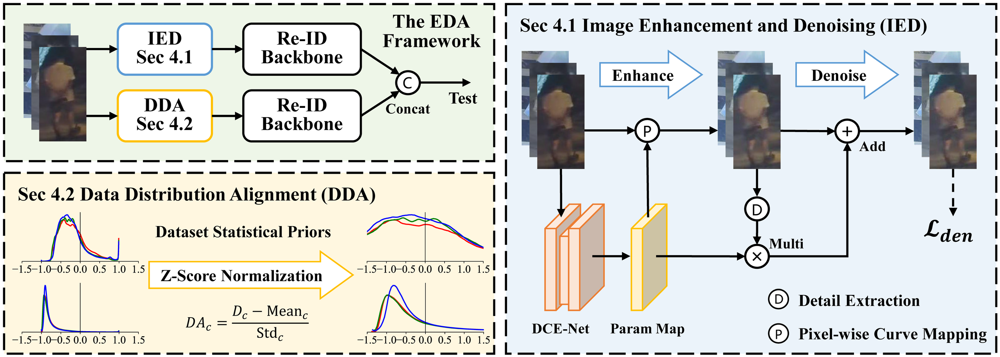

<h1 align="center">NightReID: A Large-Scale Nighttime Person Re-Identification Benchmark</h1>
<h3 align="center">Yuxuan Zhao, Weijian Ruan, He Li, Mang Ye</h3>
<h3 align="center">AAAI 2025 (Oral)</h3>


Welcome to the official repository of our paper **"NightReID: A Large-Scale Nighttime Person Re-Identification Benchmark"**.

This work contributes **NightReID**, a large-scale, real-world nighttime Re-ID dataset collected from RGB cameras, and proposes a new **EDA** (Enhancement, Denoising, and Alignment) framework that significantly improves Re-ID in challenging nighttime conditions.

## News

- **2025-02**: We released the code and dataset for NightReID.

- **2025-01**: NightReID was selected as an **Oral** presentation at AAAI 2025.

- **2024-12**: NightReID was accepted by AAAI 2025.

## Highlights

### NightReID Dataset

- **Rich Diversity**: The **largest** real-world RGB nighttime Re-ID dataset available, featuring **1,500** annotated identities and **1,096** unlabeled distractor identities, totaling **53,239** bounding boxes.
- **Challenging Scenarios**: Captures complex illuminations (low-light, backlight, overexposure), diverse weather (rain, fog), and various occlusions to mirroring real-world nighttime conditions.
- **Superior Image Quality**: Explores how **exposure gain** in RGB cameras can yield **significantly higher-quality** nighttime images, demonstrating the feasibility of nighttime RGB Re-ID.
- **Multiple Protocols**: Offers **four** evaluation protocols, varying both identity counts and distractors. enabling comprehensive evaluation of Re-ID methods under increasing difficulty.

### EDA Framework

- **Image Enhancement and Denoising (IED)**: A no-reference approach that adaptively enhances dark images and removes noise while preserving crucial details, specifically designed for Re-ID tasks.
- **Data Distribution Alignment (DDA)**: Aligns nighttime data distribution more closely to large-scale pretraining data through statistical priors for robust pretraining usage.
- **EDA framework:** Combines the complementary strengths of both IED and DDA and can seamlessly integrated into existing Re-ID pipelines.

## NightReID Dataset

We contribute a real-world nighttime RGB Re-ID dataset named **NightReID**, which provides a solid foundation and new benchmark for further research.


We welcome researchers to explore our dataset. Due to privacy considerations, users are required to sign and submit the [Agreement](Agreement.pdf) to [zhaoyuxuan@whu.edu.cn](mailto:zhaoyuxuan@whu.edu.cn). After that, you are authorized to download NightReID from [Google Drive](https://drive.google.com/drive/folders/1i8MqrxvA3NWoyVHtRyY25152iZUU7TAJ?usp=sharing) | [Baidu Netdisk](https://pan.baidu.com/s/1a540MXvat0-GabMmBHmU2g?pwd=MARS).

For more detailed statistics, file organization, and evaluation protocols, please refer to [NightReID](NightReID.md).

## EDA Framework



Our **Enhancement, Denoising, and Alignment (EDA)** framework improves nighttime Re-ID from both **image** and **data distribution** perspectives:

1. **Image Enhancement and Denoising (IED)**  
    - Enhances nighttime images in a no-reference manner.  
    - Designed to better align with Re-ID tasks.
    - Removes noise while preserving critical details.
    - Enhances brightness adaptively to avoid overexposure.  
2. **Data Distribution Alignment (DDA)**  
    - Adapts nighttime data distribution closer to large-scale pretraining data (e.g., ImageNet or LUPerson).
    - Performs z-score normalization based on dataset-level statistical priors.
    - Better leverage pre-trained models and increase overall information entropy.

Both modules can be seamlessly integrated into existing Re-ID pipelines. Please refer to [EDA](EDA.md) for implementation details and code usage.

## Experiments

### Universal (Traditional) Re-ID

|                                                              | **528IDs** | **w/ D** | **528IDs** | **w/o D** | **1000IDs** | **w/ D** | **1000IDs** | **w/o D** | **Night600** | **Night600** |
| :----------------------------------------------------------: | :--------: | :------: | :--------: | :-------: | :---------: | :------: | :---------: | :-------: | :----------: | :----------: |
|                                                              |  **R-1**   | **mAP**  |  **R-1**   |  **mAP**  |   **R-1**   | **mAP**  |   **R-1**   |  **mAP**  |   **R-1**    |   **mAP**    |
| [**BoT**](https://github.com/michuanhaohao/reid-strong-baseline) |    36.3    |   25.9   |    41.0    |   30.4    |    27.2     |   19.7   |    30.2     |   22.1    |     11.6     |     5.5      |
|      [**AGW**](https://github.com/mangye16/ReID-Survey)      |    43.7    |   32.0   |    49.0    |   37.0    |    34.8     |   25.1   |    37.9     |   27.8    |     12.2     |     6.4      |
|       [**MSINet**](https://github.com/vimar-gu/MSINet)       |    49.8    |   35.9   |    54.4    |   41.1    |    39.7     |   27.8   |    43.1     |   34.8    |     7.8      |     2.9      |
|         [**HAT**](https://github.com/gwenzhang/HAT)          |    48.1    |   35.4   |    54.0    |   40.7    |    39.2     |   28.7   |    42.8     |   31.7    |     16.7     |     7.9      |
|    [**TransReID**](https://github.com/damo-cv/TransReID)     |    55.2    |   41.0   |    59.9    |   46.1    |    46.0     |   33.2   |    49.1     |   36.2    |     9.7      |     6.5      |
| [**TransReID-SSL**](https://github.com/damo-cv/TransReID-SSL) |    65.0    |   50.8   |    70.4    |   56.4    |    58.3     |   43.2   |    61.8     |   46.7    |     20.0     |     9.5      |
|     [**PFD-Net**](https://github.com/WangTaoAs/PFD_Net)      |    53.6    |   39.4   |    58.7    |   44.5    |    44.8     |   31.9   |    48.0     |   34.9    |     3.9      |     4.2      |
| [**DC-Former**](https://github.com/alipay/Diverse-and-Compact-Transformer) |    38.5    |   26.6   |    43.0    |   31.0    |    29.4     |   20.5   |    31.7     |   23.0    |     8.5      |     5.6      |
|    [**CLIP-ReID**](https://github.com/Syliz517/CLIP-ReID)    |    56.1    |   43.0   |    61.3    |   48.7    |    49.3     |   35.9   |    52.5     |   39.4    |    17..0     |     8.1      |
|                           **EDA**                            |  **67.6**  | **52.3** |  **72.1**  | **57.6**  |  **60.1**   | **44.6** |  **63.3**   |  **48**   |   **23.8**   |   **11.6**   |

### Nighttime RGB Re-ID

|                                                | **NightReID**  | **NightReID**  |  **Night600**  |  **Night600**  |
| :--------------------------------------------: | :------------: | :------------: | :------------: | :------------: |
|                                                |   **Rank-1**   |    **mAP**     |   **Rank-1**   |    **mAP**     |
|   [**IDF**](https://github.com/Alexadlu/IDF)   |   65.6(+0.6)   |   50.7(-0.1)   |   17.2(+1.2)   |   9.2(+0.8)    |
| [**CENet**](https://github.com/Alexadlu/CENet) |       -        |       -        |   19.2(+3.2)   |   9.5(+1.1)    |
|                    **EDA**                     | **67.6(+2.6)** | **52.3(+1.5)** | **23.8(+3.8)** | **11.6(+2.1)** |

## Citation

If you find NightReID helpful in your research, please consider citing:

```bibtex
@inproceedings{NightReID,
  title     = {NightReID: A Large-Scale Nighttime Person Re-Identification Benchmark},
  author    = {Zhao, Yuxuan and Ruan, Weijian and Li, He and Ye, Mang},
  booktitle = {Proceedings of the AAAI Conference on Artificial Intelligence},
  year      = {2025},
}
```

## Contact

If you have any questions or suggestions, feel free to open an issue or contact me at [zhaoyuxuan@whu.edu.cn](mailto:zhaoyuxuan@whu.edu.cn).